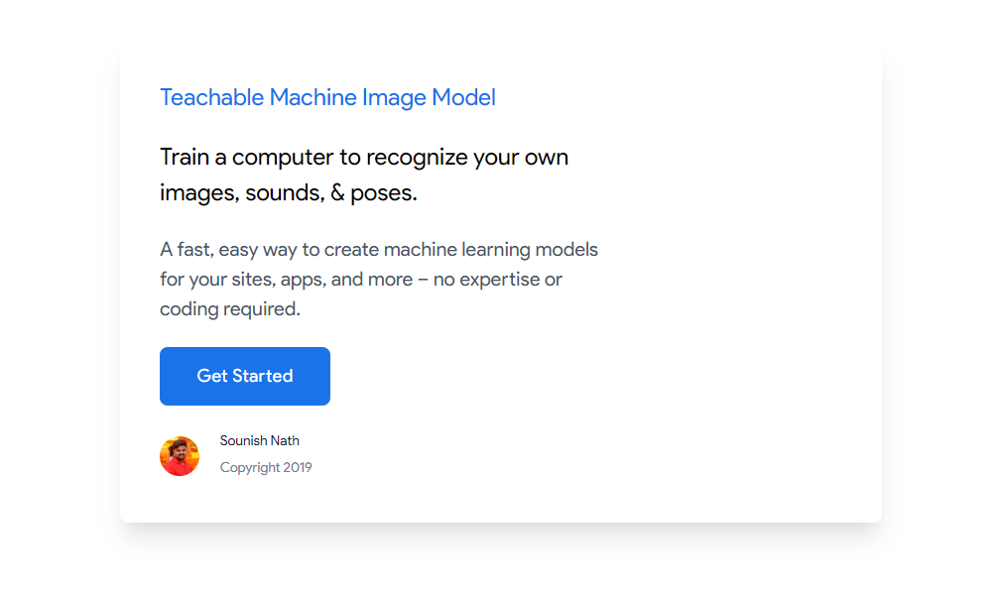

# Welcome to Machine Learning Model Web-app! 🎉🍾

Hi!, This is me **sounish nath** trying to build my first machine learning app, with **javascript** && **tensorflow**, and ui build with **Tailwindcss**.

## Primary Overview 🙌

](Machine Learning Model.mp4)

# Files 📁📂

Only **MVC** modeling now available to, after while I'll do the **Angular** lookup modelling.
I'll go with angular and other features and **machine learning** will be added.

## Comming Features 😊❤

* **Angular** modeling.
*  **PoseNet**, **Tree ML**
*  **Image modelling is now only * available***

